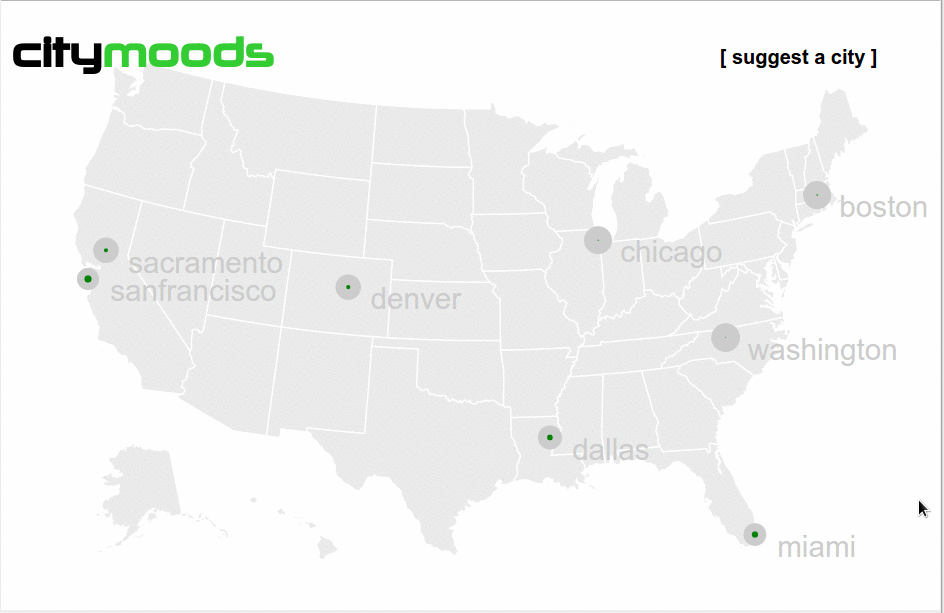

# CityMoods

## Short Description
Follow the mood of cities within the twitter ecosystem

## Long Description
The map showcases the size of the sentiment for each city. It pulses every 20 seconds showing the amount of changes within the sentiment of each city.

A node script pulls tweets from the Twitter Search API every 20 seconds using the hashtag of each city. That set of results is then sent to sentiment140 API's getting back the polarity (sentiment) of each tweet.

Those filtered tweets are sent to all connected clients for real-time updates.

## Tech Stack
### View Framework
- [Vue.js](http://vuejs.org/)

### Real-time Framework
- [Deepstream.io](http://deepstream.io)

### Web Server
- [Nginx](https://www.nginx.com/)

### Platform
- [Node.js](https://nodejs.org)

## LICENSE
---

MIT